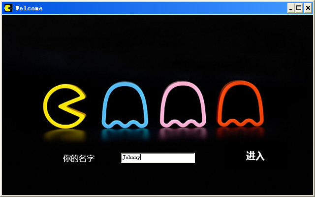
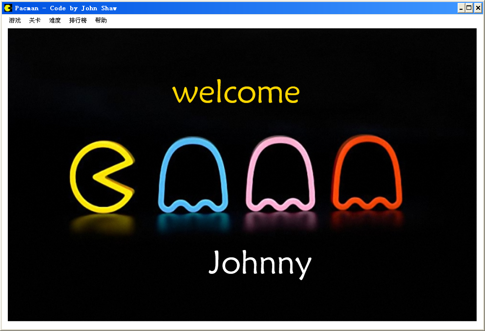
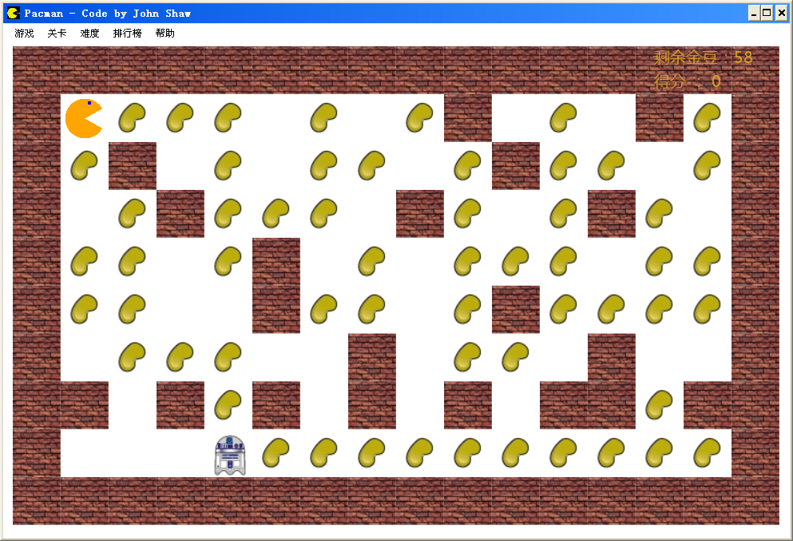
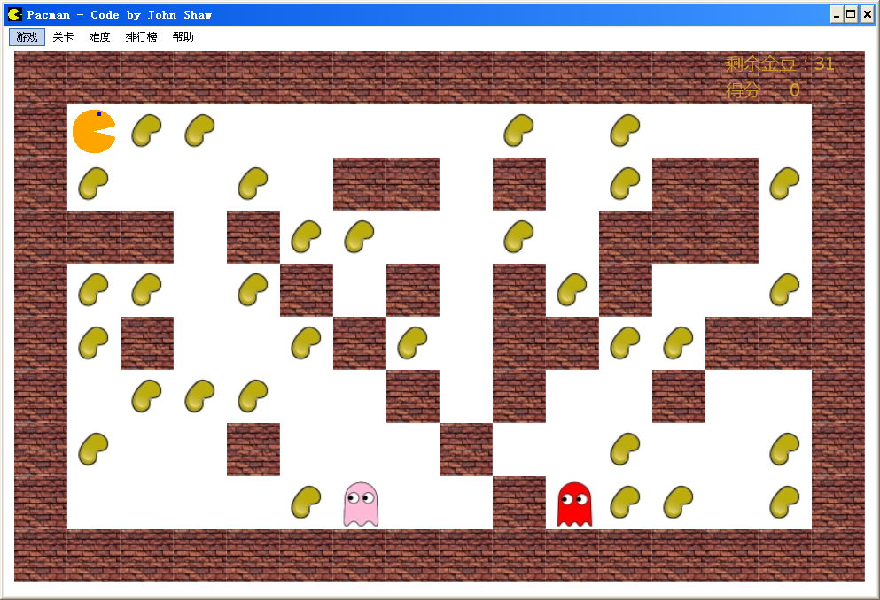
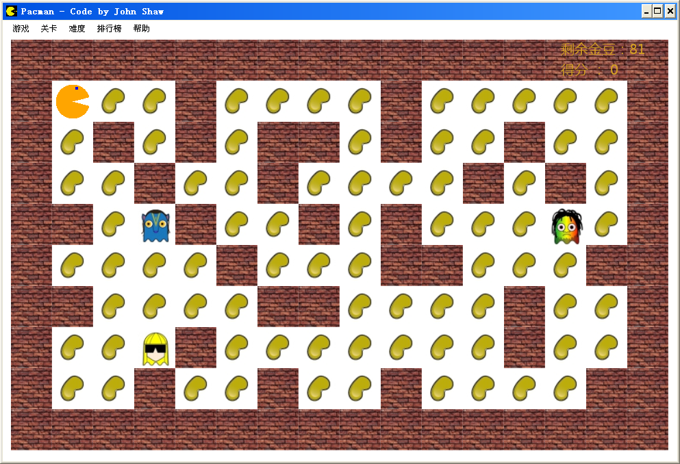
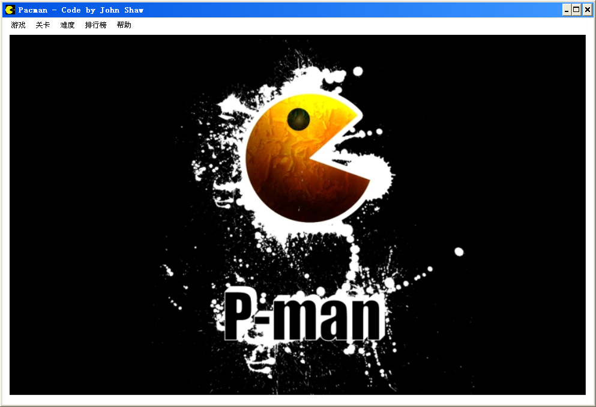
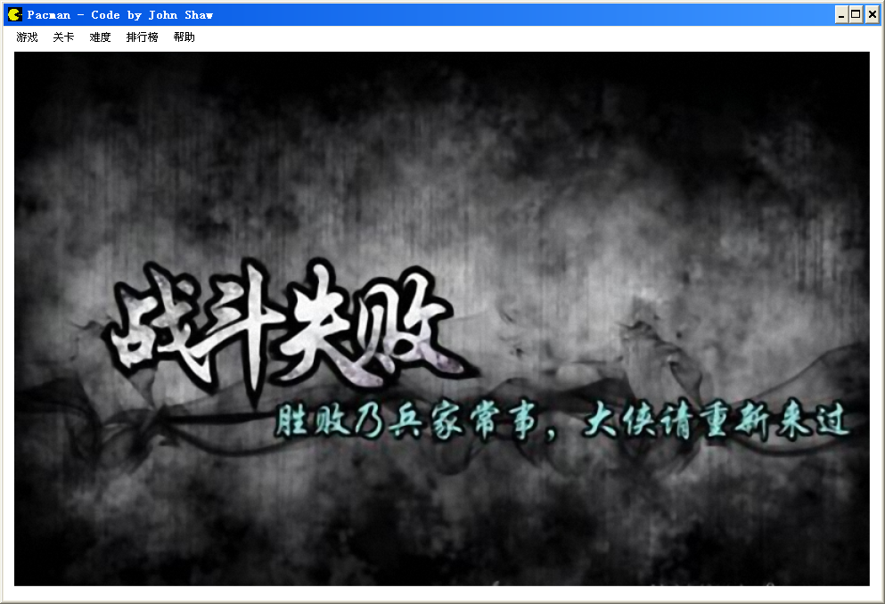
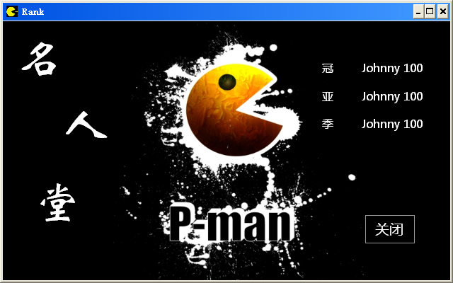
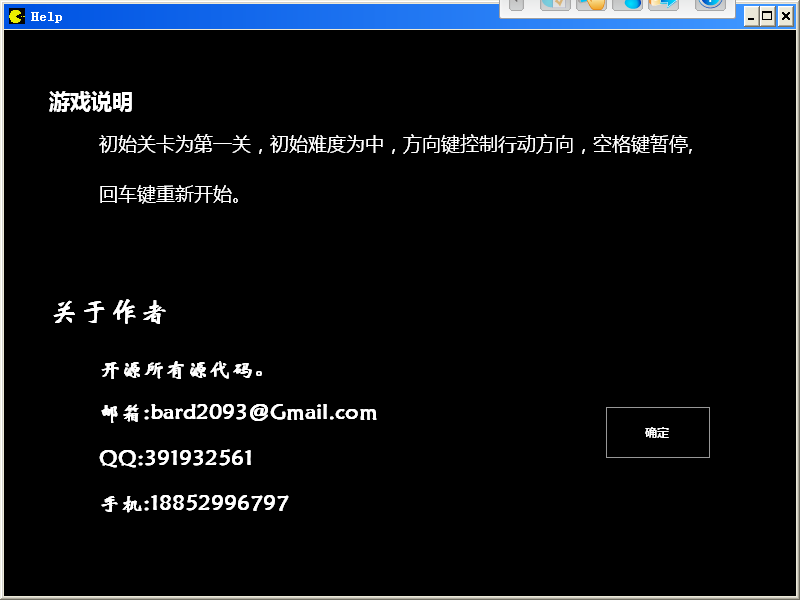

#PACMAN
-------------
这算是某种童年回忆了吧，我大一实训时的作品，也是我第一次写出完整的应用（之前只有 C 语言的算法小练习，连 C# 和 Java 都不知道是什么，再次说明编程门槛有多低），现在来看什么鬼(╯°□°）╯︵ ┻━┻，各种鬼畜的代码，然而对于当时的我来说不错了，至少审美一直还在地球人的范畴。

放几张截图作为留恋吧，代码是不想改了（要改就等于重写了），运行了下效果还是有点卡顿，不是我的锅，是 GDI+！

...(｡•ˇ‸ˇ•｡) ...

